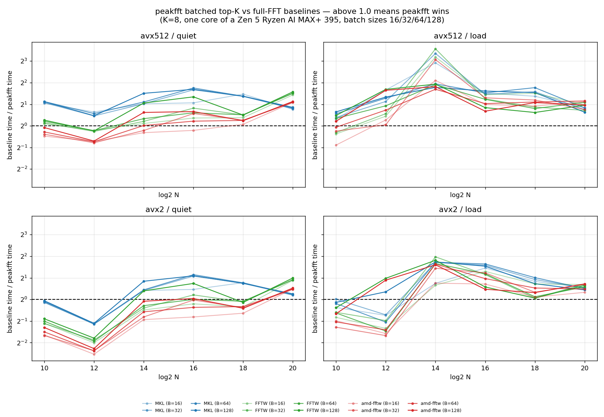

# peakfft

**Work in progress.** A testbed, not a library you should depend on yet. It has
run on exactly one machine with one compiler, the API still moves, and the size
list is short.

A single-threaded complex float32 FFT, forward and backward, built to answer one
question fast: *where are the X loudest bins, and what are their values?*

## The goal

Beat MKL on one core, using a piece of information MKL can't assume: we only care
about the top few output points. The case it's built for is matched filtering,
where the output is a white-noise time series and you want the loudest sample.
The peak is a ~5σ fluctuation among a million bins — the spectrum is not sparse,
so sparse-FFT methods don't apply.

## What it gives up to get there

- **Only the top K bins are right.** `pf_topk` never computes the other N−K to
  full accuracy and never writes them anywhere.
- **A detection floor is expected.** Give `pf_topk_many` a magnitude threshold and
  the search fuses into the transform's last stage: the compare happens while the
  outputs are still in registers, so there is no scan pass and no output store.
  Without a floor the same code still works, just slower.
- **Accuracy is spent, not maximised.** The budget is 1e-5 relative to MKL. Above
  2^16 most of the arithmetic runs on a 24-bit block-floating-point intermediate.
  Worst case measured over 266 checks is 3.6e-7, so there is room left, but the
  design assumes the budget exists.
- **c2c float32, single-threaded, powers of two 2^10 and 2^12…2^20.** Nothing else.
  Multiple cores would not be an algorithmic win, so they're out of scope.
- **x86 with AVX2 minimum.** No scalar fallback.
- **Tuned for a busy machine**, where per-core DRAM bandwidth is scarce and the
  shared L3 is thrashed. On an idle box the tuning choices would land differently.

## Numbers

One core of an AMD Ryzen AI MAX+ 395 (Zen 5). Batched, K=8, all four libraries in
one process interleaved per timed block, minimum over blocks. The baselines are
batched too — MKL through `DFTI_NUMBER_OF_TRANSFORMS`, both FFTWs through
`fftwf_plan_many_dft` — because batching speeds them up as well and comparing a
batched peakfft against unbatched baselines would mean nothing.



AVX-512, idle machine, µs per transform:

| N | B | MKL | FFTW | amd-fftw | peakfft | vs MKL | vs FFTW | vs amd |
|---|---|---|---|---|---|---|---|---|
| 2^10 | 16 | 0.81 | 0.40 | 0.29 | 0.46 | 1.74x | 0.87x | **0.62x** |
| 2^12 | 16 | 4.11 | 2.29 | 1.59 | 2.68 | 1.54x | 0.86x | **0.60x** |
| 2^14 | 16 | 21.6 | 11.3 | 8.62 | 10.3 | 2.09x | 1.10x | 0.84x |
| 2^14 | 128 | 42.7 | 25.5 | 20.4 | 14.5 | 2.94x | 1.75x | 1.40x |
| 2^16 | 16 | 130 | 76.5 | 63.8 | 55.4 | 2.35x | 1.38x | 1.15x |
| 2^16 | 128 | 233 | 182 | 115 | 74.4 | 3.13x | 2.45x | 1.54x |
| 2^18 | 32 | 1146 | 645 | 538 | 456 | 2.51x | 1.41x | 1.18x |
| 2^20 | 64 | 3925 | 6301 | 4533 | 2329 | 1.69x | 2.71x | 1.95x |

Relative error against MKL is 1.1e-07 to 3.2e-07 across the whole sweep, and the
top-K indices match MKL's ranking exactly everywhere.

**It beats MKL at every size and batch.** It beats amd-fftw from 2^14 upward, by up
to 1.95x at 2^20. **It loses to amd-fftw at 2^10 and 2^12**, by about 1.6x, and that
is the honest state of things.

Why it loses there, measured rather than guessed: the generated codelets run at
303 GF/s, 93% of this machine's AVX-512 FMA peak, so the arithmetic is not the
problem — at 2^12 it is 0.81 µs of a 2.61 µs transform. The other 1.80 µs is
spread across eight passes over 32 KiB with no hotspot; ablating the corner turn,
the four-step twiddle, the index remap or the load pattern each saves nothing, and
several make it slower. amd-fftw's entire non-arithmetic budget at that size is
0.78 µs. Closing this needs fewer passes (twiddle-fused codelets, so the four-step
twiddle rides inside the last butterfly), not more tuning. Not done.

Under contention the picture changes in our favour — the baselines move more bytes
and suffer more — but those measurements swing by several-fold run to run even
taking minima, so treat them as a trend and not as numbers.

Two caveats on the baselines. MKL takes its *generic* path on this AMD part
(`MKL_VERBOSE` says "Intel(R) Architecture processors"), so some of that margin is
dispatch rather than algorithm, which is why both FFTWs are in the table. And MKL
exports its own `fftwf_*` symbols, so the harness `dlopen`s stock FFTW with
`RTLD_DEEPBIND`, links amd-fftw whole-archive ahead of MKL, and prints `dladdr`
provenance on every run — without that, both FFTW columns silently become MKL.

## Using it

C:

```c
#include "peakfft.h"
pf_plan *p = pf_create(1u << 20);
pf_peak peaks[8];
int n = pf_topk(p, in, 8, peaks, PF_FORWARD);   /* peaks[i].index / .re / .im / .magnitude */
pf_fft(p, in, out, PF_BACKWARD);                /* full transform, either direction */
pf_destroy(p);
```

Restrict the search to a window with `pf_topk_window(p, in, K, peaks, sign, start, end)`.
Reported indices stay absolute. Bins outside the window are never tested, so a
narrower window is slightly cheaper (about 0.9x for a 60% window) — the transform
itself costs the same.

Batched, which is the interface that gets tuned:

```c
pf_peak peaks[B * K];  int counts[B];
int total = pf_topk_many(p, in, /*dist*/N, B, K, threshold,
                         peaks, counts, PF_FORWARD, start, end);
/* transform b's peaks are peaks[b*K .. b*K+counts[b]), loudest first */
```

`dist` is the complex-element stride between transforms, so the batch is an array
of separate transforms rather than an interleave — each one keeps its own
cache-resident working set. (Interleaving was tried: it deletes the four-step
corner turn entirely, which is real, but multiplies the inter-stage working set by
the vector width and lands at 0.21–0.47x. `docs/machine-notes.md` has the numbers.)

`threshold` is a magnitude floor combined with K: the result is the K loudest bins
that are also above the floor. Pass 0 to disable. A non-zero floor is also the
fast path — it primes the candidate test instead of filtering afterwards, which at
K=64 is worth 10.6x at 2^10 and 3.0x at 2^12, and at N=1024 lets the search fuse
into the transform's final stage.

Python:

```python
import numpy as np, peakfft
x = (np.random.randn(1<<20) + 1j*np.random.randn(1<<20)).astype(np.complex64)
peaks = peakfft.topk(x, 8)            # structured array
peaks = peakfft.topk(x, 8, window=(a, b))   # only bins a <= k < b
peaks["index"], peaks["value"], peaks["magnitude"]
y = peakfft.fft(x, "backward")        # full transform

xs = x.reshape(64, -1)                        # a batch, one transform per row
rows = peakfft.topk_many(xs, 8, threshold=t)  # list of 64 structured arrays
```

Neither direction scales by 1/N, matching FFTW and MKL, so forward then backward
gives N·x.

## ISA selection

The back end is chosen at load time from CPUID: AVX-512 if the CPU has F/DQ/BW/VL,
otherwise AVX2. Override it with `PEAKFFT_ISA` to test both on one machine:

```sh
PEAKFFT_ISA=avx2        ./tests/test_topk    # force the 8-lane back end
PEAKFFT_ISA=balanced512 ./tests/test_topk    # generic source at 16 lanes
make test                                    # runs all three
```

`pf_isa()` reports which one is active. The dispatcher is compiled for the
baseline ISA and the two back ends for their own, so the library loads on a
machine without AVX-512.

## How it works

Above 2^16 the transform is memory bound, so the design counts bytes, not flops.
Not bandwidth bound, though — that distinction took a while to get right. At 2^20
stage A walks the input with an 8 KiB stride, and on this core that shape sustains
7.6 GB/s where a sequential read of the same volume gets 43.9. The load alone is
53% of the transform. Widening the touched run recovers the rate in a
microbenchmark (512 B gives 19.1 GB/s), but doing it for real needs group buffers
that then evict L2 exactly as fast as the wider stream helps, so it nets nothing.

Four-step decomposition throughout: 1024×1024 at 2^20 with a 24-bit quantised
intermediate, a balanced N₁×N₂ ≈ √N split below 2^17 where everything is
L2-resident and nothing needs quantising. Complex data is kept split (separate
real/imag registers), so a complex multiply is 4 FMAs with no shuffles. The
32-point units are generated unrolled Stockham codelets (`src/gen.py`), radix-8×4,
which is 2 passes instead of radix-2's 5 — worth 1.65x on its own at 2^10.

Each element-space stage is SIMD-across-16-transforms, so every twiddle inside a
codelet is a broadcast and the codelets themselves contain no shuffles. The
four-step corner turn between the stages is a register transpose, fused into stage
A; it costs about 8% and is the one place lanes have to move.

Two things that mattered more than expected: padding the element stride from 32 to
33, because stride-2048B access mapped onto about two L1 sets and thrashed (13x on
that sub-stage); and a two-level twiddle factorisation
`W_N[n₁k₂] = W_N[16g·k₂]·W_N[l·k₂]`, which keeps the tables at 128 KiB instead of
8 MiB.

`docs/machine-notes.md` is the lab notebook — measured instruction throughput,
pipe-overlap rules, the amd-fftw disassembly, and every idea that was tried and
dropped with the number that killed it. Non-temporal stores, huge pages, stage-A
group blocking, batch-interleaved layout, split-radix at 32/64, prefetching at any
distance, bf16, IFMA: all measured, none kept.

What top-K buys: the output is never materialised (8 MiB not written at 2^20), the
intermediate can be stored at reduced precision, and — given a detection floor —
the search itself collapses into the transform's final stage instead of being a
pass over the results. That
intermediate is 24-bit block floating point split across a 16-bit screening plane
and an 8-bit residual; screening reads only the 16-bit plane, and the residual is
touched only for the few columns that hold a winner, which then get recomputed at
full precision. The backward transform is `conj(forward(conj(x)))`, and both
conjugations fold into passes that already exist, so it costs the same as forward.

## Build

```sh
make            # library and tests
make test       # unit tests and top-K validation on all back ends
make test-mkl MKLINC=/path/include MKLLIB=/path/lib
make bench    MKLINC=/path/include MKLLIB=/path/lib
pip install .   # Python extension
```

`make codelets` regenerates `src/codelets.h`. CI builds with explicit ISA flags,
runs what the runner supports, and fails if `codelets.h` drifts from `gen.py`.

## Tests

`tests/test_units.c` covers the transpose, each codelet against a direct DFT,
codelet stride equivalence, the 24-bit quantiser, the top-K heap, the 1024-point
transform against a double-precision O(N²) DFT, and analytic identities at every
size in both directions — impulse response, pure tone, Parseval, linearity, and
`backward(forward(x)) == N·x`. It needs no external FFT library.

`tests/test_topk.c` checks `pf_topk` against a brute-force ranking of `pf_fft`
over white noise, noise+tone, noise+5 tones and a deliberate near-tie, for
K = 1, 8, 64.

`tests/test_batch.c` is the strict one for the batched path — 283k checks over
size x batch x K x direction x window x threshold. The threshold cases matter most:
a floor that primes the candidate test wrongly shows up as a *missing* peak, not a
wrong value, so every row is compared against a brute-force scan for count, rank,
index, value and an explicit no-false-negative bound.

`tests/test_vs_mkl.c` is the one that matters for accuracy: the other two are
self-consistent by construction and cannot see the error the reduced-precision
intermediate introduces. It compares against MKL in both directions.
