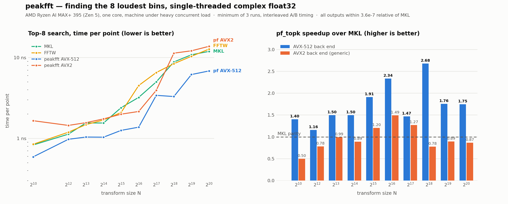

# peakfft

**Work in progress.** A testbed, not a library you should depend on yet. It has
run on exactly one machine with one compiler, the API still moves, and the size
list is short.

A single-threaded complex float32 FFT, forward and backward, built to answer one
question fast: *where are the X loudest bins, and what are their values?*

## The goal

Beat MKL on one core, using a piece of information MKL can't assume: we only care
about the top few output points. The case it's built for is matched filtering,
where the output is a white-noise time series and you want the loudest sample.
The peak is a ~5σ fluctuation among a million bins — the spectrum is not sparse,
so sparse-FFT methods don't apply.

## What it gives up to get there

- **Only the top K bins are right.** `pf_topk` never computes the other N−K to
  full accuracy and never writes them anywhere.
- **Accuracy is spent, not maximised.** The budget is 1e-5 relative to MKL. Above
  2^16 most of the arithmetic runs on a 24-bit block-floating-point intermediate.
  Worst case measured over 266 checks is 3.6e-7, so there is room left, but the
  design assumes the budget exists.
- **c2c float32, single-threaded, powers of two 2^10 and 2^12…2^20.** Nothing else.
  Multiple cores would not be an algorithmic win, so they're out of scope.
- **x86 with AVX2 minimum.** No scalar fallback.
- **Tuned for a busy machine**, where per-core DRAM bandwidth is scarce and the
  shared L3 is thrashed. On an idle box the tuning choices would land differently.

## Numbers

One core of an AMD Ryzen AI MAX+ 395 (Zen 5), machine under heavy load.
Interleaved timing, minimum of 3 runs, K=8.



| N | MKL | FFTW | `pf_topk` AVX-512 | vs MKL | `pf_topk` AVX2 |
|---|---|---|---|---|---|
| 2^10 | 0.85 µs | 0.86 µs | 0.60 µs | 1.40x | 1.69 µs |
| 2^12 | 4.61 µs | 4.87 µs | 3.98 µs | 1.16x | 5.92 µs |
| 2^13 | 12.7 µs | 12.1 µs | 8.49 µs | 1.50x | 12.8 µs |
| 2^14 | 25.3 µs | 27.6 µs | 16.9 µs | 1.50x | 28.5 µs |
| 2^15 | 78.5 µs | 68.4 µs | 41.1 µs | 1.91x | 65.2 µs |
| 2^16 | 210 µs | 295 µs | 90.0 µs | 2.34x | 141 µs |
| 2^17 | 655 µs | 855 µs | 446 µs | 1.47x | 515 µs |
| 2^18 | 2.31 ms | 2.20 ms | 0.86 ms | 2.68x | 2.97 ms |
| 2^19 | 5.67 ms | 5.43 ms | 3.23 ms | 1.76x | 6.35 ms |
| 2^20 | 12.5 ms | 13.3 ms | 7.16 ms | 1.75x | 14.4 ms |

The AVX-512 back end beats MKL at every size, 1.16x to 2.68x. The AVX2 back end
is roughly at parity — ahead between 2^15 and 2^17, behind elsewhere. It is the
generic implementation (no unrolled codelets, fp32 intermediate), so it gives up
both of the things that make the AVX-512 path fast. Improving it means generating
256-bit codelets and porting the quantised intermediate; neither is done.

Two caveats. MKL takes its *generic* code path on this AMD part (`MKL_VERBOSE`
says "Intel(R) Architecture processors"), so some of the margin is dispatch rather
than algorithm — which is why FFTW is in the table too. And at 2^10–2^13 `pf_fft`
is actually faster than `pf_topk`: the full output write costs 0.04 µs there, so
there is nothing for the top-K path to save, while scanning the magnitudes costs
more than that.

## Using it

C:

```c
#include "peakfft.h"
pf_plan *p = pf_create(1u << 20);
pf_peak peaks[8];
int n = pf_topk(p, in, 8, peaks, PF_FORWARD);   /* peaks[i].index / .re / .im / .magnitude */
pf_fft(p, in, out, PF_BACKWARD);                /* full transform, either direction */
pf_destroy(p);
```

Python:

```python
import numpy as np, peakfft
x = (np.random.randn(1<<20) + 1j*np.random.randn(1<<20)).astype(np.complex64)
peaks = peakfft.topk(x, 8)            # structured array
peaks["index"], peaks["value"], peaks["magnitude"]
y = peakfft.fft(x, "backward")        # full transform
```

Neither direction scales by 1/N, matching FFTW and MKL, so forward then backward
gives N·x.

## ISA selection

The back end is chosen at load time from CPUID: AVX-512 if the CPU has F/DQ/BW/VL,
otherwise AVX2. Override it with `PEAKFFT_ISA` to test both on one machine:

```sh
PEAKFFT_ISA=avx2        ./tests/test_topk    # force the 8-lane back end
PEAKFFT_ISA=balanced512 ./tests/test_topk    # generic source at 16 lanes
make test                                    # runs all three
```

`pf_isa()` reports which one is active. The dispatcher is compiled for the
baseline ISA and the two back ends for their own, so the library loads on a
machine without AVX-512.

## How it works

Above 2^16 the transform is DRAM-bandwidth bound, so the design counts bytes, not
flops. A traffic model (`time ≈ bytes ÷ 2.7 GB/s`) predicted every measurement
here to within a few percent and picked every optimisation.

Four-step decomposition throughout: 1024×1024 at 2^20 with a 24-bit quantised
intermediate, a balanced N₁×N₂ ≈ √N split below 2^17 where everything is
L2-resident and nothing needs quantising. Complex data is kept split (separate
real/imag registers), so a complex multiply is 4 FMAs with no shuffles. The
32-point units are generated unrolled Stockham codelets (`src/gen.py`), radix-8×4,
which is 2 passes instead of radix-2's 5 — worth 1.65x on its own at 2^10.

Each stage is SIMD-across-16-transforms, which does two jobs at once: strided
column reads become full-cache-line granules, and the SIMD lane index *is* the
intermediate's column index, so no stage needs an in-register transpose.

Three things that mattered more than expected: padding the element stride from 32
to 33, because stride-2048B access mapped onto about two L1 sets and thrashed
(13x on that sub-stage); non-temporal stores for the intermediate, avoiding
read-for-ownership (4x on that write); and a two-level twiddle factorisation
`W_N[n₁k₂] = W_N[16g·k₂]·W_N[l·k₂]`, which keeps the tables at 128 KiB instead of
8 MiB.

What top-K buys: the output is never materialised (8 MiB not written at 2^20,
about 3 ms), and the intermediate can be stored at reduced precision. That
intermediate is 24-bit block floating point split across a 16-bit screening plane
and an 8-bit residual; screening reads only the 16-bit plane, and the residual is
touched only for the few columns that hold a winner, which then get recomputed at
full precision. The backward transform is `conj(forward(conj(x)))`, and both
conjugations fold into passes that already exist, so it costs the same as forward.

## Build

```sh
make            # library and tests
make test       # unit tests and top-K validation on all back ends
make test-mkl MKLINC=/path/include MKLLIB=/path/lib
make bench    MKLINC=/path/include MKLLIB=/path/lib
pip install .   # Python extension
```

`make codelets` regenerates `src/codelets.h`. CI builds with explicit ISA flags,
runs what the runner supports, and fails if `codelets.h` drifts from `gen.py`.

## Tests

`tests/test_units.c` covers the transpose, each codelet against a direct DFT,
codelet stride equivalence, the 24-bit quantiser, the top-K heap, the 1024-point
transform against a double-precision O(N²) DFT, and analytic identities at every
size in both directions — impulse response, pure tone, Parseval, linearity, and
`backward(forward(x)) == N·x`. It needs no external FFT library.

`tests/test_topk.c` checks `pf_topk` against a brute-force ranking of `pf_fft`
over white noise, noise+tone, noise+5 tones and a deliberate near-tie, for
K = 1, 8, 64.

`tests/test_vs_mkl.c` is the one that matters for accuracy: the other two are
self-consistent by construction and cannot see the error the reduced-precision
intermediate introduces. It compares against MKL in both directions.
