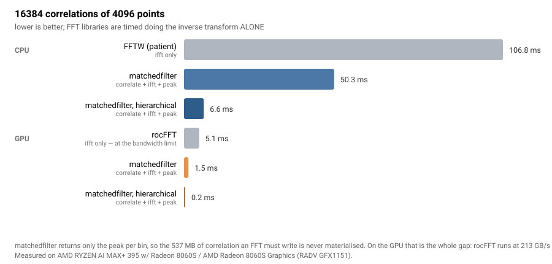

[](https://ahnitz.github.io/matchedfilter/)

**Batched matched filtering that returns peaks, not correlations.**

Single precision throughout, on CPU or GPU, from one wheel.

[Documentation](https://ahnitz.github.io/matchedfilter/) · [See it work](https://ahnitz.github.io/matchedfilter/demo.html) · [Benchmarks](https://ahnitz.github.io/matchedfilter/benchmarks.html) · [Caveats](https://ahnitz.github.io/matchedfilter/caveats.html)

---



16384 correlations of 4096 points. FFTW and rocFFT time the **inverse transform alone**;
matchedfilter times the product, transform **and** peak scan. These measurements
show the benefit of avoiding the 537 MB correlation output.

The same workload on an **Apple M2** (Metal): 12.03 ms flat and 1.88 ms hierarchical,
10.2× and 7.8× over that machine's CPU.

---

> [!WARNING]
> **This is under rapid development.** The API still moves, the GPU backend
> is new and covers a smaller range than the CPU one, and performance work
> is ongoing. Pin a version if you depend on it.
>
> **Contributions and collaboration are very welcome** — if you are working
> on something this could serve, or want to help with it,
> [open an issue](https://github.com/ahnitz/matchedfilter/issues/new) or get
> in touch. Areas that would benefit most right now: a Metal/macOS backend,
> per-device tuning on hardware other than a Radeon 8060S, and transform
> lengths above 16384 on the GPU.

```bash
pip install matchedfilter
```

```python
import matchedfilter as mf

filt = mf.MatchedFilter(16384, ndata=16, ntemplates=64)
filt.set_data(data_spectra)           # (16, 16384) complex64, already FFT'd
filt.set_templates(template_spectra)  # (64, 16384) complex64

peaks = filt.run(binsize=1024, threshold=5.5)
peaks["index"], peaks["value"]        # where, and what
```

### Why it is faster

A frequency-domain matched filter is not usually limited by arithmetic. It is
limited by **memory**: the inverse transform writes out a full correlation —
`n` complex samples for every (data, template) pair — and the peak scan reads
all of it back. For 16384 pairs of 4096 points that is 537 MB written and read
to find a few thousand numbers.

Most searches then threshold that output and throw the rest away. Saying so up
front is the whole trick: this library **fuses the product, the transform and
the peak scan into one pass**, so the correlation never reaches memory at all —
only the peak per bin comes out. The arithmetic is the same as anyone else's.
The traffic is what disappears, and the traffic was the cost.

The optional hierarchical mode goes further: a cheap decimated pass rules most
pairs out before the full correlation runs on them at all.

## What it does

- **Peak-only output.** One record per bin, not n samples per pair. `binsize`
  sets the output resolution; `window` bounds which lags are searched at all,
  so an overlap-save caller never pays for the wrap-around it would discard.
- **Batched.** D data segments against T templates is a symmetric product.
  Hand over as much of both as you have; one pair at a time forfeits most of
  the throughput.
- **CPU or GPU, one wheel.** `device="gpu"` runs the same call on a Vulkan
  device — AMD, NVIDIA, Intel or Apple. The kernels are compiled ahead of
  time and ship inside the wheel: nothing to choose, nothing extra to
  install, no toolchain on your machine.
- **Frequency domain in, single precision throughout.** You bring the forward
  transforms from whatever you already use; this owns the correlation and the
  peak scan. In and out are `complex64`. There is no float64 path and none
  is planned.
- **Optional hierarchical mode.** A cheap decimated pass first, the full
  correlation only where that pass cannot rule a peak out, with a budget for
  how often it may miss one.
- **Measured, not modelled.** Every tuning choice comes from a measurement of
  the real code path, and where there is no measurement the library refuses
  rather than guessing.

## Choosing where it runs

```python
mf.devices()
# [Device('cpu:0', 'AMD Ryzen 9 9950X', backend='AVX3'),
#  Device('gpu:0', 'AMD Radeon 8060S', backend='vulkan')]

mf.MatchedFilter(4096, device="gpu")    # or "gpu:1", or "auto"
```

The spelling is PyTorch's. The default is **always the CPU**: running
somewhere else because that somewhere happens to exist would change numerics
and failure modes without being asked. Both devices return the same fields,
the same shapes and the same `index == -1` convention for a bin that nothing
cleared, which is what lets one set of tests assert against both.

The GPU path covers transform lengths **1024 to 16384** — one workgroup
carries a whole transform, and that is what 1024 threads reach. Longer
transforms raise, naming the sizes that work, rather than quietly running
somewhere else. The CPU covers 1024 to 1048576. See
[Current capabilities](https://ahnitz.github.io/matchedfilter/using-it.html)
for the rest of what the GPU backend does and does not do yet.

## The hierarchical mode

Correlate a low-frequency slice of each template first, and pay for the full
correlation only where that slice leaves a peak possible.

```python
hf = mf.HierarchicalFilter(16384, ndata=16, ntemplates=64,
                           snr=6.0,    # the threshold you intend to use
                           fd=1e-3)    # false-dismissal budget

hf.set_reference(expected_output_power)   # what the tuning is keyed on
hf.set_templates(template_spectra)
hf.set_data(data_spectra)
peaks = hf.run(binsize=16384, threshold=6.0)
```

It picks its own band, oversampling, taps and threshold margin from measured
tables and the reference you supply. It can only omit peaks, never invent
them; `fd` is the budget for how often it may omit one.

**It assumes enough of the output power sits low in the band** for a narrow
slice to bound the full result. That tends to hold for chirp-like templates.
For templates whose power is flat or concentrated high, the slice bounds
nothing useful and the first pass is pure added cost.

`set_reference` wants the expected power of the filter **output**, not the
template's own power — the two differ whenever the data is coloured. Check it
against your own templates before relying on it.

## Documentation

| | |
|---|---|
| [See it work](https://ahnitz.github.io/matchedfilter/demo.html) | plots generated by running the library, either side of the threshold |
| [Using it](https://ahnitz.github.io/matchedfilter/using-it.html) | inputs, outputs, devices, and the hierarchical mode |
| [Numerical accuracy](https://ahnitz.github.io/matchedfilter/precision.html) | single precision against a float64 reference, as a function of SNR |
| [Benchmarks](https://ahnitz.github.io/matchedfilter/benchmarks.html) | cost per correlation, against FFTW and MKL (when installed) |
| [Hierarchical benchmarks](https://ahnitz.github.io/matchedfilter/hierarchical-benchmarks.html) | what the first pass skips, per threshold |
| [Design notes](https://ahnitz.github.io/matchedfilter/notes.html) | why it is built this way, including what measurement ruled out |
| [Caveats](https://ahnitz.github.io/matchedfilter/caveats.html) | what it does not do, and where the tuning tables stop |

Measure it on your own machine:

```bash
python -m matchedfilter.benchmark
```

### Run the benchmarks

```bash
python -m pip install pyfftw       # optional FFTW reference
python -m matchedfilter.benchmark --n 1024 4096 16384 --reps 7 --json bench.json
```

Install `mkl-fft` and `mkl` for an optional MKL reference where supported.
Reference columns time only the inverse FFT; matchedfilter includes the product
and peak scan. NumPy checks correctness but is not a timing baseline. Without
FFTW/MKL, the library timings and correctness checks still run.
Benchmark CI reports automatic CPU selection and a distinct AVX2 comparison;
correctness CI continues to exercise every compiled SIMD target.

## Status

Work in progress. The API still moves. The hierarchical tuning tables cover a
limited range of transform lengths and refuse outside them rather than
guessing. Single-threaded by design on the CPU; parallelism is the caller's
to arrange. See [Caveats](https://ahnitz.github.io/matchedfilter/caveats.html).

Wheels for CPython 3.9–3.14 on Linux x86-64 and macOS arm64; elsewhere pip
builds from source, which needs numpy and a C compiler.

## Contributing

Issues and pull requests welcome at
[github.com/ahnitz/matchedfilter](https://github.com/ahnitz/matchedfilter) —
[fork it](https://github.com/ahnitz/matchedfilter/fork),
[open an issue](https://github.com/ahnitz/matchedfilter/issues/new).

```bash
git clone https://github.com/ahnitz/matchedfilter
cd matchedfilter
git submodule update --init third_party/highway   # the SIMD layer
pip install -e .
pytest
```

The GPU kernels are Slang, compiled to SPIR-V by `tools/build_spirv.py`.
That needs [slangc](https://github.com/shader-slang/slang/releases) and is a
build-time step only — the compiled blobs are committed, and nothing at run
time imports a shader compiler.

## License

MIT
